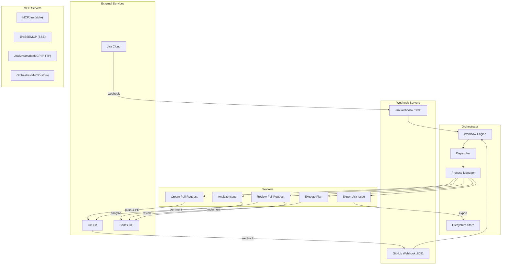

# Sprinter

**An AI-powered development automation toolkit** that connects Jira, Codex, and GitHub into a fully automated pipeline — from issue creation to pull request review.

Sprinter provides a durable orchestration engine, MCP servers for LLM integration, webhook listeners for real-time event processing, and a suite of specialized workers that handle each stage of the development lifecycle.

## Architecture



### End-to-End Pipeline

When a Jira issue is created, the orchestrator automatically executes this workflow:

```text
Jira Issue Created
  → Export Jira Issue (download issue, comments, attachments, Confluence pages)
  → Analyze Issue (Codex CLI read-only analysis → analysis_and_plan.md)
  → Execute Plan (Codex CLI workspace-write → code changes + commit_log.md)
  → Create Pull Request (git branch, commit, push, open draft PR)
  → Review Pull Request (Codex CLI read-only review → PR comment)
```

Each stage is gated by configurable safety flags, so you can automate the full pipeline or stop at any point for manual review.

---

## Quick Start

### 1. Set Up the Environment

Run the setup script to bootstrap everything:

```bash
python3 systemSetup.py
```

This will:
- Create a Python virtual environment (`.venv`)
- Install all dependencies
- Generate a `.env` template with all required variables
- Create `config.yaml` from the example template
- Validate your environment
- Check for external tools (ngrok, codex, git)

### 2. Configure Environment Variables

Edit the generated `.env` file with your actual credentials:

```bash
# Required — Atlassian
ATLASSIAN_EMAIL=your-email@example.com
ATLASSIAN_API_TOKEN=your-atlassian-api-token

# Required — GitHub
SPRINTER_GITHUB_TOKEN=your-github-personal-access-token
SPRINTER_GITHUB_OWNER=your-github-org-or-username
SPRINTER_GITHUB_REPO=your-repository-name

# Required — Webhook Security
SPRINTER_WEBHOOK_SECRET=a-secure-random-string
SPRINTER_GITHUB_WEBHOOK_SECRET=another-secure-random-string

# Required — ngrok (for public webhook URLs)
NGROK_AUTHTOKEN=your-ngrok-auth-token
```

Then source it:
```bash
source .env
```

### 3. Start the Orchestrator

```bash
.venv/bin/python -m orchestrator start
```

This automatically starts:
- The **Jira webhook server** on `http://127.0.0.1:8090/webhooks/jira`
- The **GitHub webhook server** on `http://127.0.0.1:8091/webhooks/github`
- The **event loop** that processes events and dispatches workers

### 4. Register Webhooks

In a separate terminal, register your webhook URLs with Jira and GitHub via ngrok:

```bash
# Register Jira webhook
source .env
.venv/bin/python -m webhooks.setup

# Register GitHub webhook
.venv/bin/python -m github_webhooks.setup
```

### 5. Trigger a Workflow

Either create a Jira issue (the webhook will trigger automatically), or submit manually:

```bash
.venv/bin/python -m orchestrator submit-jira-created SCRUM-123 \
  --url "https://your-site.atlassian.net/browse/SCRUM-123"
```

### 6. Monitor Progress

```bash
# Global status
.venv/bin/python -m orchestrator status

# Specific workflow with history
.venv/bin/python -m orchestrator workflow SCRUM-123 --history
```

---

## Installation (Manual)

If you prefer to set up manually instead of using `systemSetup.py`:

```bash
git clone <repository-url>
cd Sprinter
python3 -m venv .venv
source .venv/bin/activate
pip install -r requirements.txt
```

### Prerequisites

| Tool | Required For | Install |
|---|---|---|
| Python 3.10+ | Everything | System package manager |
| ngrok | Public webhook URLs | [ngrok.com](https://ngrok.com/) |
| Codex CLI | Analysis and implementation | OpenAI Codex |
| Git | PR creation and pushing | System package manager |

---

## Configuration Reference

### Environment Variables

| Variable | Required | Description |
|---|---|---|
| `ATLASSIAN_EMAIL` | Yes | Jira/Confluence login email |
| `ATLASSIAN_API_TOKEN` | Yes | Atlassian API token |
| `SPRINTER_GITHUB_TOKEN` | Yes | GitHub personal access token (repo scope) |
| `SPRINTER_GITHUB_OWNER` | Yes | GitHub username or organization |
| `SPRINTER_GITHUB_REPO` | Yes | Target GitHub repository |
| `SPRINTER_WEBHOOK_SECRET` | Yes | Secret for Jira webhook authentication |
| `SPRINTER_GITHUB_WEBHOOK_SECRET` | Yes | Secret for GitHub webhook signature verification |
| `NGROK_AUTHTOKEN` | Yes* | ngrok authentication token (*if using public webhooks) |
| `SPRINTER_GITHUB_BASE_BRANCH` | No | Base branch for PRs (default: `main`) |
| `SPRINTER_GITHUB_BRANCH_PREFIX` | No | Branch prefix for PRs (default: `sprinter/`) |
| `SPRINTER_GITHUB_DRAFT_PR` | No | Create PRs as draft (default: `true`) |

### Configuration Files

| File | Purpose |
|---|---|
| `config.yaml` | Core Atlassian credentials and export settings |
| `orchestrator/config.yaml` | Orchestrator settings, safety flags, worker config, webhook servers |
| `webhooks/config.yaml` | Jira webhook server settings |
| `webhooks/ngrok_config.yaml` | Jira ngrok setup script settings |
| `github_webhooks/ngrok_config.yaml` | GitHub ngrok setup script settings |
| `codex_analysis/config.yaml` | Codex analyzer settings |
| `codex_implementer/config.yaml` | Codex implementer settings |

### Safety Flags

Control which pipeline stages run automatically in `orchestrator/config.yaml`:

```yaml
safety:
  auto_export_after_issue_created: true    # Export when Jira issue is created
  auto_analyze_after_export: true          # Run Codex analysis after export
  auto_execute_after_plan: true            # Apply code changes after analysis
  auto_create_pr_after_execution: true     # Open PR after implementation
  auto_review_after_pr: true               # Post Codex review on PR
```

Set any flag to `false` to gate that stage for manual approval.

---

## Managing Workflows (CLI)

```bash
# Show all workflow states
.venv/bin/python -m orchestrator status
.venv/bin/python -m orchestrator status --json

# Inspect a specific workflow with event history
.venv/bin/python -m orchestrator workflow SCRUM-123 --history

# Manually trigger a workflow
.venv/bin/python -m orchestrator submit-jira-created SCRUM-123 \
  --url "https://example.atlassian.net/browse/SCRUM-123"

# Control a workflow
.venv/bin/python -m orchestrator pause SCRUM-123
.venv/bin/python -m orchestrator resume SCRUM-123
.venv/bin/python -m orchestrator retry SCRUM-123
```

---

## Components

### Orchestrator

The durable event-driven workflow engine. Manages the state machine, dispatches workers, handles retries, and auto-starts webhook servers.

→ [Orchestrator Deep Dive](docs/orchestrator.md)

### Workers

Subprocess units dispatched by the orchestrator for each pipeline stage:

| Worker | Command Type | Module |
|---|---|---|
| Export Jira Issue | `export_jira_issue` | `workers.export_jira_worker` |
| Analyze Issue | `analyze_issue` | `workers.planner_worker` |
| Execute Plan | `execute_plan` | `workers.implementer_worker` |
| Create Pull Request | `create_pull_request` | `workers.github_pusher_worker` |
| Review Pull Request | `review_pull_request` | `workers.github_reviewer_worker` |

→ [Workers Documentation](docs/workers.md)

### MCP Servers

Model Context Protocol servers for LLM client integration:

| Server | Transport | Purpose |
|---|---|---|
| MCPJira | stdio | Jira export/create tools |
| JiraSSEMCP | SSE (HTTP) | Same tools, SSE transport |
| JiraStreamableMCP | Streamable HTTP | Same tools, with CORS support |
| OrchestratorMCP | stdio | Workflow management tools |

→ [MCP Servers Documentation](docs/mcp_servers.md)

### Webhook Servers

HTTP servers that receive events from Jira and GitHub:

| Server | Port | Events |
|---|---|---|
| Jira Webhook | 8090 | Issue created/updated/deleted, comments, attachments |
| GitHub Webhook | 8091 | Pull requests, pushes, review comments |

→ [Webhook Servers Documentation](docs/webhook_servers.md)

### Codex Analyzer

Read-only planning stage that generates `analysis_and_plan.md`.

→ [Codex Analyzer Documentation](docs/codex_analysis.md)

### Codex Implementer

Write-enabled stage that applies code changes and generates `commit_log.md`.

→ [Codex Implementer Documentation](docs/codex_implementer.md)

### GitHub Service

Git operations, PR creation, and automated code review.

→ [GitHub Workers Documentation](docs/github_workers.md)

---

## Full Orchestrator Setup Guide

This is a complete, step-by-step walkthrough to get the entire Sprinter system running:

### Step 1: Clone and Install

```bash
git clone <repository-url>
cd Sprinter
python3 systemSetup.py
```

### Step 2: Set Up Atlassian Credentials

1. Go to [Atlassian API Tokens](https://id.atlassian.com/manage-profile/security/api-tokens)
2. Create a new API token
3. Add to `.env`:
   ```
   ATLASSIAN_EMAIL=your-email@example.com
   ATLASSIAN_API_TOKEN=<paste-token-here>
   ```

### Step 3: Set Up GitHub Credentials

1. Go to [GitHub Personal Access Tokens](https://github.com/settings/tokens)
2. Create a token with `repo` scope
3. Add to `.env`:
   ```
   SPRINTER_GITHUB_TOKEN=<paste-token-here>
   SPRINTER_GITHUB_OWNER=your-org-or-username
   SPRINTER_GITHUB_REPO=your-repo-name
   ```

### Step 4: Set Up ngrok

1. Install ngrok: `brew install ngrok` (or download from [ngrok.com](https://ngrok.com/))
2. Get your auth token from the [ngrok dashboard](https://dashboard.ngrok.com/)
3. Add to `.env`:
   ```
   NGROK_AUTHTOKEN=<paste-token-here>
   ```

### Step 5: Generate Webhook Secrets

```bash
# Generate random secrets
python3 -c "import secrets; print(secrets.token_urlsafe(32))"
```

Add to `.env`:
```
SPRINTER_WEBHOOK_SECRET=<generated-secret-1>
SPRINTER_GITHUB_WEBHOOK_SECRET=<generated-secret-2>
```

### Step 6: Configure Safety Flags

Edit `orchestrator/config.yaml` to control automation level:

```yaml
safety:
  auto_export_after_issue_created: true    # Always safe
  auto_analyze_after_export: true          # Read-only, safe
  auto_execute_after_plan: false           # ⚠️ Writes code — review plan first
  auto_create_pr_after_execution: false    # Review changes first
  auto_review_after_pr: true              # Read-only review, safe
```

### Step 7: Source Environment and Start

```bash
source .env
.venv/bin/python -m orchestrator start
```

### Step 8: Register Webhooks (in a new terminal)

```bash
source .env
.venv/bin/python -m webhooks.setup           # Register Jira webhook
.venv/bin/python -m github_webhooks.setup     # Register GitHub webhook
```

### Step 9: Verify

```bash
# Check webhook server readiness
curl http://127.0.0.1:8090/ready
curl http://127.0.0.1:8091/ready

# Check orchestrator status
.venv/bin/python -m orchestrator status
```

---

## Testing

```bash
# Full test suite
.venv/bin/python -m unittest discover -s tests -v

# Specific component tests
.venv/bin/python -m unittest tests.test_main -v
.venv/bin/python -m unittest tests.test_webhooks -v
.venv/bin/python -m unittest tests.test_github_webhooks -v
.venv/bin/python -m unittest tests.test_codex_analysis -v
.venv/bin/python -m unittest tests.test_codex_implementer -v
.venv/bin/python -m unittest tests.test_github_service -v
.venv/bin/python -m unittest tests.test_orchestrator_implementation -v
.venv/bin/python -m unittest tests.test_orchestrator_github -v
.venv/bin/python -m unittest tests.test_orchestrator_webhook_servers -v
```

## Architecture Documentation

For a visual interactive overview, open `architecture.html` in your browser.

## License

Internal project.
