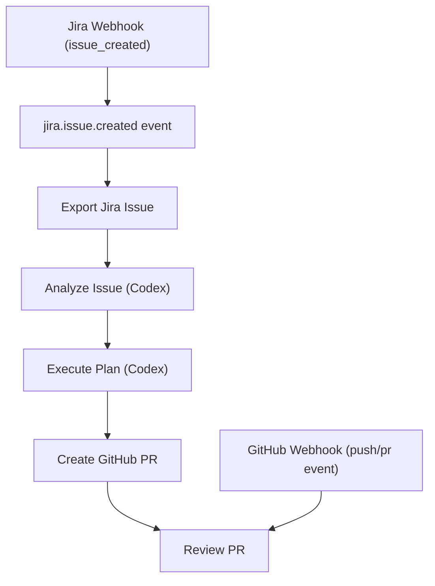

# Sprinter

A toolkit for local Jira/Confluence extraction, Codex analysis, Codex implementation, and automated orchestration.

Sprinter provides a durable orchestration engine that seamlessly connects Atlassian integrations with OpenAI Codex to fully automate your development workflows—from issue creation to pull request review.

## Architecture & Workflow Engine

Sprinter is driven by a durable event and command engine called the **Orchestrator**. It handles multi-step workflows automatically without losing state, ensuring every action is recorded and can be retried or inspected.

The default Jira-to-GitHub automated flow looks like this:



For a detailed visual overview, view the [Architectural Documentation](architecture.html) (open the HTML file in your browser).

## Installation & Prerequisites

1. **Clone the repository:**
   ```bash
   git clone <repository-url>
   cd Sprinter
   ```

2. **Set up a Python virtual environment:**
   ```bash
   python3 -m venv .venv
   source .venv/bin/activate
   ```

3. **Install dependencies:**
   ```bash
   pip install -r requirements.txt
   ```

4. **Required External Dependencies:**
   - [ngrok](https://ngrok.com/) installed locally (if you need public webhooks for Jira/GitHub).
   - Codex CLI configured and authenticated.

## Configuration

Before starting the orchestrator, you must configure credentials and paths. It is highly recommended to use environment variables to avoid hardcoding sensitive information.

1. **Environment Variables:**
   You can provide the following environment variables (e.g., via a `.env` file or export them directly):
   - `ATLASSIAN_EMAIL`: Your Jira/Confluence login email.
   - `ATLASSIAN_API_TOKEN`: Your Atlassian API token.
   - `SPRINTER_GITHUB_TOKEN`: GitHub personal access token (with repo scopes).
   - `SPRINTER_GITHUB_OWNER`: GitHub username or organization name.
   - `SPRINTER_GITHUB_REPO`: Target GitHub repository name.
   - `SPRINTER_WEBHOOK_SECRET`: Secure secret for validating incoming webhooks.
   - `NGROK_AUTHTOKEN`: Your ngrok authentication token.

2. **Configuration Files:**
   The project uses several YAML files for specific component configurations. Ensure they are correctly set up (they now safely rely on the environment variables mentioned above):
   - `config.yaml`: Core Atlassian integration settings.
   - `webhooks/config.yaml`: Jira Webhook server configuration.
   - `webhooks/ngrok_config.yaml`: Jira Webhook ngrok setup.
   - `github_webhooks/ngrok_config.yaml`: GitHub Webhook ngrok setup.
   - `orchestrator/config.yaml`: Controls automation safety flags (e.g., gating PR creation or execution) and worker limits.

## Setting up the Orchestrator & Webhooks

The orchestrator manages the entire lifecycle, including starting the local HTTP webhook listeners for Jira and GitHub.

### 1. Start the Orchestrator

```bash
.venv/bin/python -m orchestrator start
```

By default, this command automatically starts:
- The Jira webhook server on `http://127.0.0.1:8090/webhooks/jira`
- The GitHub webhook server on `http://127.0.0.1:8091/webhooks/github`

### 2. Register Webhooks with Jira and GitHub

To expose your local webhook servers to the internet so Jira and GitHub can reach them, you can use the built-in ngrok setup scripts.

**For Jira:**
```bash
# Registers the webhook in your Jira project using the NGROK_AUTHTOKEN
.venv/bin/python -m webhooks.setup
```

**For GitHub:**
```bash
# Registers the webhook in your GitHub repo using the NGROK_AUTHTOKEN
.venv/bin/python -m github_webhooks.setup
```

## Managing Workflows (CLI)

The orchestrator includes a CLI for monitoring and controlling automated workflows.

- **Check Global Status:**
  ```bash
  .venv/bin/python -m orchestrator status
  ```

- **Inspect a Specific Workflow:**
  ```bash
  .venv/bin/python -m orchestrator workflow SCRUM-123 --history
  ```

- **Manually Trigger a Workflow:**
  ```bash
  .venv/bin/python -m orchestrator submit-jira-created SCRUM-123 --url "https://example.atlassian.net/browse/SCRUM-123"
  ```

- **Control Workflow Execution:**
  ```bash
  .venv/bin/python -m orchestrator pause SCRUM-123
  .venv/bin/python -m orchestrator resume SCRUM-123
  .venv/bin/python -m orchestrator retry SCRUM-123
  ```

## Component Deep Dives

For detailed documentation on specific parts of the Sprinter toolkit, see the following guides in the `docs/` directory:

- [Orchestrator Deep Dive](docs/orchestrator.md)
- [Codex Analyzer](docs/codex_analysis.md)
- [Codex Implementer](docs/codex_implementer.md)
- [GitHub Workers](docs/github_workers.md)

*Note: MCP servers (Model Context Protocol) like `MCPJira`, `JiraWebhookMCP`, `JiraSSEMCP`, and `OrchestratorMCP` are also available as part of this toolkit for direct LLM integration.*

## Testing

To run the automated tests for the different components:

```bash
# Run orchestrator and webhook tests
.venv/bin/python -m unittest tests.test_orchestrator_implementation tests.test_orchestrator_github tests.test_orchestrator_webhook_servers -v

# Run the full test suite
.venv/bin/python -m unittest discover -s tests -v
```

## License

Internal project.
