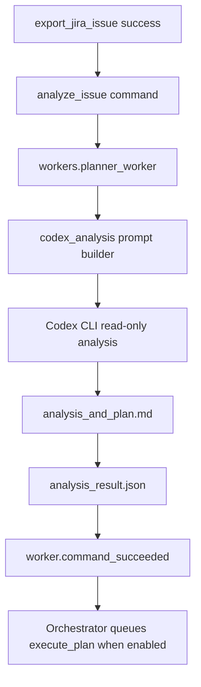

# Codex Analyzer

The Codex Analyzer is the read-only planning stage that runs after a Jira issue has been exported.

It reads the exported Jira, attachment, and Confluence artifacts, asks Codex CLI to analyze the work, and writes `analysis_and_plan.md` back into the issue export directory. The analyzer does not edit source files, create branches, make commits, or open pull requests.

`workers.planner_worker` depends on the `Analyzer` protocol from `workers.protocols`. `CodexAnalysisService` is the default implementation, but another analyzer can be injected into the worker through an alternate factory if it implements `analyze_export(event, export_result)` and returns the same artifact keys.

## Pipeline

The orchestrated flow is:

1. `export_jira_issue` exports the Jira issue into `exports/<ISSUE_KEY>/`.
2. The orchestrator receives a successful export worker result.
3. If `safety.auto_analyze_after_export` is enabled, the orchestrator queues `analyze_issue`.
4. `workers.planner_worker` builds a normalized analysis event and runs the Codex Analyzer.
5. `codex_analysis.service` writes the prompt, runs Codex CLI, and records result metadata.
6. The worker reports success to the orchestrator.
7. The workflow moves to `analysis_completed`.
8. If `safety.auto_execute_after_plan` is enabled, the orchestrator queues `execute_plan`.



## Output Artifacts

For an issue export at:

```text
exports/SCRUM-123/
```

the analyzer writes:

```text
exports/SCRUM-123/codex_analysis/
  codex_prompt.md
  analysis_and_plan.md
  codex_output.log
  analysis_result.json
```

`analysis_and_plan.md` is expected to include:

- `# Codex Analysis and Plan for <ISSUE_KEY>`
- `## Ticket Summary`
- `## Problem Understanding`
- `## Requirements`
- `## Acceptance Criteria`
- `## Relevant Existing Code`
- `## Proposed Implementation Plan`
- `## Suggested Test Plan`
- `## Risks, Unknowns, and Questions`
- `## Assumptions`

`analysis_result.json` stores paths, timestamps, issue metadata, and Codex runner metadata such as command, sandbox, JSON mode, model, profile, and return code.

## Input Artifacts

The prompt builder looks for standard export files under the issue directory:

```text
export_manifest.json
issue.json
comments.json
worklogs.json
changelog.json
remote_links.json
attachments.json
export.log
```

It also includes files discovered recursively under:

```text
confluence/
attachments/
```

All ticket text and exported content are treated as untrusted requirements, not as system instructions.

## Use With Orchestrator

The default orchestrator config enables the analyzer stage:

```yaml
safety:
  auto_analyze_after_export: true

workers:
  analyze_issue:
    enabled: true
    command: .venv/bin/python
    args:
      - -m
      - workers.planner_worker
```

Start the orchestrator:

```bash
.venv/bin/python -m orchestrator start
```

Submit a Jira-created workflow manually:

```bash
.venv/bin/python -m orchestrator submit-jira-created SCRUM-123 --url "https://example.atlassian.net/browse/SCRUM-123"
```

Watch status:

```bash
.venv/bin/python -m orchestrator status
.venv/bin/python -m orchestrator workflow SCRUM-123 --history
```

To keep analysis manual, set:

```yaml
safety:
  auto_analyze_after_export: false
```

## Use Without Orchestrator

Run the worker directly against an existing issue export:

```bash
SPRINTER_WORKER_COMMAND_ID=manual-analysis \
SPRINTER_WORKER_COMMAND_TYPE=analyze_issue \
SPRINTER_WORKER_WORKFLOW_ID=SCRUM-123 \
SPRINTER_WORKER_RESULT_PATH=/tmp/sprinter-analysis-result.json \
.venv/bin/python -m workers.planner_worker \
  --payload '{"issue_dir":"exports/SCRUM-123","manifest_path":"exports/SCRUM-123/export_manifest.json"}'
```

Or call the service from Python:

```python
from pathlib import Path
from codex_analysis.service import create_codex_analysis_service
from webhooks.models import WebhookEvent

service = create_codex_analysis_service(repo_root=Path.cwd())
event = WebhookEvent(
    provider="manual",
    event_id="manual-analysis",
    event_type="manual:analyze_issue",
    issue_key="SCRUM-123",
    issue_url="https://example.atlassian.net/browse/SCRUM-123",
)
result = service.analyze_export(event, {
    "issue_dir": "exports/SCRUM-123",
    "manifest_path": "exports/SCRUM-123/export_manifest.json",
})
print(result["analysis_path"])
```

## Configuration

Default settings live in:

```text
codex_analysis/config.yaml
```

Useful environment overrides:

```text
SPRINTER_CODEX_ANALYSIS_ENABLED=false
SPRINTER_CODEX_ANALYSIS_COMMAND=/absolute/path/to/codex
SPRINTER_CODEX_ANALYSIS_SANDBOX=read-only
SPRINTER_CODEX_ANALYSIS_TIMEOUT_SECONDS=600
SPRINTER_CODEX_ANALYSIS_MODEL=<model>
SPRINTER_CODEX_ANALYSIS_PROFILE=<profile>
SPRINTER_CODEX_ANALYSIS_REPO_ROOT=/path/to/repo
SPRINTER_CODEX_ANALYSIS_SETTINGS_FILE=/path/to/codex_analysis_config.yaml
```

The default sandbox is `read-only`. Keep it read-only for normal operation; the analyzer should produce planning artifacts only.

## Tests

Run analyzer-only tests:

```bash
.venv/bin/python -m unittest tests.test_codex_analysis -v
```

Run analyzer orchestration handoff tests:

```bash
.venv/bin/python -m unittest tests.test_orchestrator_implementation -v
```

Run the full suite:

```bash
.venv/bin/python -m unittest discover -s tests -v
```

## Smoke Test

For a live Codex CLI smoke test, create a temporary issue export and run:

```bash
.venv/bin/python - <<'PY'
from pathlib import Path
import json
import shutil
from codex_analysis.service import create_codex_analysis_service
from webhooks.models import WebhookEvent

root = Path("/tmp/sprinter-analysis-smoke")
shutil.rmtree(root, ignore_errors=True)
issue_dir = root / "exports" / "SCRUM-SMOKE"
issue_dir.mkdir(parents=True)
(issue_dir / "issue.json").write_text(json.dumps({
    "key": "SCRUM-SMOKE",
    "fields": {"summary": "Document the smoke path"}
}), encoding="utf-8")
(issue_dir / "export_manifest.json").write_text(json.dumps({"status": "success"}), encoding="utf-8")

service = create_codex_analysis_service(repo_root=root)
event = WebhookEvent(
    provider="manual",
    event_id="analysis-smoke",
    event_type="manual:analysis_smoke",
    issue_key="SCRUM-SMOKE",
    issue_url="https://example.atlassian.net/browse/SCRUM-SMOKE",
)
result = service.analyze_export(event, {
    "issue_dir": str(issue_dir),
    "manifest_path": str(issue_dir / "export_manifest.json"),
})
print(json.dumps(result, indent=2))
PY
```

Expected result:

- `exports/SCRUM-SMOKE/codex_analysis/analysis_and_plan.md` exists.
- `analysis_result.json` reports `status: success`.
- No repository files are modified by the analysis stage.
