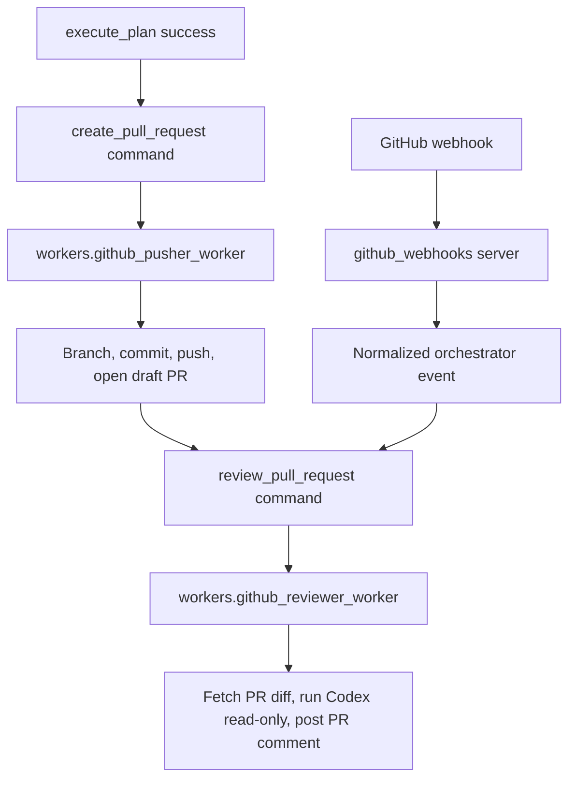

# GitHub Worker Service

The GitHub Worker Service adds the automation layer after `execute_plan`.

When the Codex Implementer writes `codex_implementation/commit_log.md`, the orchestrator can queue a PR worker, then queue an automated reviewer for the created PR.

## Pipeline



## Packages

- `github_service.settings`: environment-backed GitHub and Codex review settings.
- `github_service.git`: small Git command adapter used by the pusher.
- `github_service.client`: GitHub REST API client using `requests`.
- `github_service.pusher`: commits implementation changes and opens a PR.
- `github_service.reviewer`: fetches PR or commit details, runs Codex in read-only mode, and posts a summary comment.
- `github_webhooks`: signature verification, delivery dedupe, payload parsing, and HTTP server.
- `workers.github_pusher_worker`: orchestrator worker for `create_pull_request`.
- `workers.github_reviewer_worker`: orchestrator worker for `review_pull_request`.

Compatibility wrappers are also available as `workers.github_pr_worker` and `workers.reviewer_worker`.

## Configuration

Required for PR creation and review:

```text
SPRINTER_GITHUB_TOKEN=<github token>
SPRINTER_GITHUB_OWNER=<owner or org>
SPRINTER_GITHUB_REPO=<repo name>
```

Required for webhook ingestion:

```text
SPRINTER_GITHUB_WEBHOOK_SECRET=<shared webhook secret>
```

Optional defaults:

```text
SPRINTER_GITHUB_BASE_BRANCH=main
SPRINTER_GITHUB_REMOTE=origin
SPRINTER_GITHUB_BRANCH_PREFIX=sprinter/
SPRINTER_GITHUB_DRAFT_PR=true
SPRINTER_GITHUB_API_BASE_URL=https://api.github.com
SPRINTER_GITHUB_REVIEW_CODEX_COMMAND=codex
SPRINTER_GITHUB_REVIEW_CODEX_SANDBOX=read-only
SPRINTER_GITHUB_REVIEW_TIMEOUT_SECONDS=900
```

The reviewer requires `read-only` sandbox mode. The pusher never commits directly to the base branch and never merges, squashes, or approves a PR.

## Use With Orchestrator

The orchestrator config enables three automation modes:

```yaml
safety:
  auto_execute_after_plan: true
  auto_create_pr_after_execution: true
  auto_review_after_pr: true

workers:
  create_pull_request:
    enabled: true
    command: .venv/bin/python
    args:
      - -m
      - workers.github_pusher_worker
  review_pull_request:
    enabled: true
    command: .venv/bin/python
    args:
      - -m
      - workers.github_reviewer_worker
```

Start the orchestrator:

```bash
.venv/bin/python -m orchestrator start
```

After `execute_plan` succeeds, the orchestrator queues `create_pull_request` when `auto_create_pr_after_execution` is true. After PR creation succeeds, it queues `review_pull_request` when `auto_review_after_pr` is true.

You can disable either stage:

```yaml
safety:
  auto_create_pr_after_execution: false
  auto_review_after_pr: false
```

## Use Without Orchestrator

Run the PR pusher directly against an implementation result:

```bash
SPRINTER_WORKER_COMMAND_ID=manual-pr \
SPRINTER_WORKER_COMMAND_TYPE=create_pull_request \
SPRINTER_WORKER_WORKFLOW_ID=SCRUM-123 \
SPRINTER_WORKER_RESULT_PATH=/tmp/sprinter-github-pr-result.json \
.venv/bin/python -m workers.github_pusher_worker \
  --payload '{"issue_dir":"exports/SCRUM-123","commit_log_path":"exports/SCRUM-123/codex_implementation/commit_log.md"}'
```

Run the reviewer directly for a PR:

```bash
SPRINTER_WORKER_COMMAND_ID=manual-review \
SPRINTER_WORKER_COMMAND_TYPE=review_pull_request \
SPRINTER_WORKER_WORKFLOW_ID=SCRUM-123 \
SPRINTER_WORKER_RESULT_PATH=/tmp/sprinter-github-review-result.json \
.venv/bin/python -m workers.github_reviewer_worker \
  --payload '{"issue_dir":"exports/SCRUM-123","pr_number":123}'
```

Run the reviewer directly for a commit SHA. If GitHub cannot associate the commit with a PR, the worker writes a skipped result and does not comment:

```bash
SPRINTER_WORKER_COMMAND_ID=manual-review-commit \
SPRINTER_WORKER_COMMAND_TYPE=review_pull_request \
SPRINTER_WORKER_WORKFLOW_ID=SCRUM-123 \
SPRINTER_WORKER_RESULT_PATH=/tmp/sprinter-github-review-commit-result.json \
.venv/bin/python -m workers.github_reviewer_worker \
  --payload '{"issue_dir":"exports/SCRUM-123","commit_sha":"abc123"}'
```

## Webhook Server

When the orchestrator starts, the GitHub webhook server starts automatically by default from `orchestrator/config.yaml`:

```yaml
webhook_servers:
  github:
    enabled: true
    host: 127.0.0.1
    port: 8091
    path: /webhooks/github
```

You can still run the GitHub webhook server by itself:

```bash
.venv/bin/python -m github_webhooks.server --host 127.0.0.1 --port 8091 --path /webhooks/github
```

For local setup through a public ngrok URL and automatic GitHub repository webhook registration, use the one-file setup helper:

```bash
SPRINTER_GITHUB_TOKEN=<github token> \
SPRINTER_GITHUB_OWNER=<owner or org> \
SPRINTER_GITHUB_REPO=<repo name> \
SPRINTER_GITHUB_WEBHOOK_SECRET=<shared webhook secret> \
.venv/bin/python -m github_webhooks.setup
```

The setup helper reads `github_webhooks/ngrok_config.yaml`, starts `github_webhooks.server`, starts ngrok, registers a repository webhook through the GitHub REST API, checks `/ready`, and sends a signed smoke event. Useful flags:

```bash
.venv/bin/python -m github_webhooks.setup --skip-smoke-test
.venv/bin/python -m github_webhooks.setup --keep-existing
.venv/bin/python -m github_webhooks.setup --no-register
.venv/bin/python -m github_webhooks.setup --config github_webhooks/ngrok_config.yaml
```

GitHub should send `pull_request`, `push`, and `pull_request_review_comment` events. The first version handles these normalized events:

- `github.pull_request.opened`
- `github.pull_request.synchronize`
- `github.pull_request.reopened`
- `github.pull_request_review_comment.created`
- `github.push.main`

Pull request events queue `review_pull_request` when review automation is enabled. Push-to-main events queue review only when a PR can be associated with the commit SHA; otherwise the reviewer records a skipped artifact.
Pull request review comments are recorded as observed events only, so Sprinter's own review comment does not trigger another review cycle.

Webhook delivery IDs are deduped in `exports/.github_webhooks` by default.

## Output Artifacts

PR creation writes:

```text
exports/SCRUM-123/github_pr/
  pr_description.md
  github_pr_result.json
```

Review writes:

```text
exports/SCRUM-123/github_review/
  review_prompt.md
  review.md
  codex_review.log
  github_comment_payload.json
  review_result.json
```

## Tests

Run GitHub-specific tests:

```bash
.venv/bin/python -m unittest tests.test_github_service -v
.venv/bin/python -m unittest tests.test_github_webhooks -v
.venv/bin/python -m unittest tests.test_github_webhook_setup -v
.venv/bin/python -m unittest tests.test_orchestrator_github -v
```

Run the full suite:

```bash
.venv/bin/python -m unittest discover -s tests -v
```

The tests use fake GitHub clients and fake Codex runners. Live GitHub operation is manual and requires the token, owner, repo, and remote configuration above.
