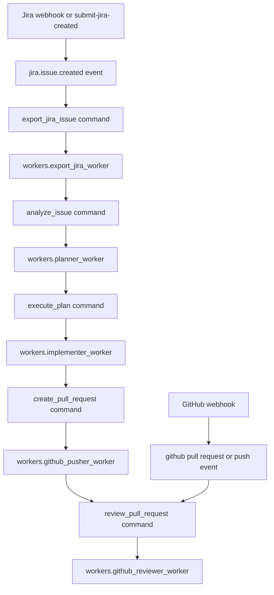

# Orchestrator

The Orchestrator is Sprinter's durable workflow engine. It turns Jira and GitHub events into ordered worker commands, records every transition on disk, and advances a ticket through export, analysis, implementation, pull request creation, and review.

The orchestrator does not do the heavy work itself. It owns the state machine, starts webhook servers, queues commands, launches worker subprocesses, receives worker results, and decides the next command.

## Pipeline

The default Jira-to-GitHub flow is:



Each worker writes a normal `WorkerResult`. The process manager converts successful or failed results into orchestrator events:

```text
worker.command_succeeded
worker.command_failed
```

The engine consumes those events and queues the next command when the configured safety flags allow it.

## Core Modules

- `orchestrator.models`: event, command, workflow, worker-result, and retry data models.
- `orchestrator.settings`: YAML-backed runtime settings from `orchestrator/config.yaml`.
- `orchestrator.store`: filesystem storage for events, commands, workflow state, and worker logs.
- `orchestrator.event_buffer`: writes and claims pending events.
- `orchestrator.engine`: workflow state machine and command scheduling rules.
- `orchestrator.dispatcher`: finds pending commands and dispatches workers by type.
- `orchestrator.process_manager`: starts worker subprocesses, captures logs, reads result files, and emits worker result events.
- `orchestrator.retry`: retry policy and delayed retry command creation.
- `orchestrator.webhook_manager`: starts and stops orchestrator-owned Jira and GitHub webhook HTTP servers.
- `orchestrator.service`: public API used by CLI and webhook integrations.
- `orchestrator.cli`: command-line entrypoint.

## Storage Layout

By default, durable state is written under:

```text
exports/.orchestrator/
```

The store layout is:

```text
exports/.orchestrator/
  events/
    pending/
    processing/
    completed/
    failed/
  commands/
    <command_type>/
      pending/
      running/
      completed/
      failed/
  workflows/
    <workflow_id>/
      state.json
  logs/
    <command_id>.stdout.log
    <command_id>.stderr.log
    <command_id>.result.json
```

This makes the orchestrator restart-friendly: pending events and commands remain on disk, completed history remains inspectable, and worker logs are tied to command ids.

## Events

Primary external events:

- `jira.issue.created`
- `github.pull_request.opened`
- `github.pull_request.synchronize`
- `github.pull_request.reopened`
- `github.pull_request_review_comment.created`
- `github.push.main`

Control and worker events:

- `retry_requested`
- `pause_requested`
- `resume_requested`
- `worker.command_succeeded`
- `worker.command_failed`

Jira-created events create workflows and normally queue export. GitHub pull request events can queue review. GitHub review-comment events are observed only so Sprinter does not review its own comments in a loop.

## Commands

Default worker command types:

- `export_jira_issue`: exports the Jira issue and related artifacts.
- `analyze_issue`: runs Codex Analyzer and writes `analysis_and_plan.md`.
- `execute_plan`: runs Codex Implementer and writes `commit_log.md`.
- `create_pull_request`: commits changes, pushes a branch, and opens a GitHub PR.
- `review_pull_request`: reviews PR or associated commit changes and comments on the PR.

Each worker receives:

```text
SPRINTER_WORKER_COMMAND_ID
SPRINTER_WORKER_COMMAND_TYPE
SPRINTER_WORKER_WORKFLOW_ID
SPRINTER_WORKER_RESULT_PATH
```

and a JSON command payload through:

```bash
--payload '<json>'
```

Workers must write a `WorkerResult` JSON file to `SPRINTER_WORKER_RESULT_PATH`.

## Workflow Statuses

Workflow status values include:

```text
new
export_requested
export_running
issue_exported
analysis_requested
analysis_running
analysis_completed
execution_requested
execution_running
execution_completed
pr_requested
pr_running
pr_completed
review_requested
review_running
review_completed
blocked
paused
```

The current implementation updates requested and completed states around command scheduling and worker result events. `active_command_id` prevents overlapping work for the same workflow while a command is running.

## Configuration

Default settings live in:

```text
orchestrator/config.yaml
```

Important sections:

```yaml
orchestrator:
  storage_root: exports/.orchestrator
  exports_root: exports
  event_poll_interval_seconds: 1.0
  command_poll_interval_seconds: 1.0
  default_max_attempts: 3
  default_retry_backoff_seconds:
    - 10
    - 30
    - 90

safety:
  auto_export_after_issue_created: true
  auto_analyze_after_export: true
  auto_execute_after_plan: true
  auto_create_pr_after_execution: true
  auto_review_after_pr: true

webhook_servers:
  auto_start: true
  jira:
    enabled: true
    host: 127.0.0.1
    port: 8090
    path: /webhooks/jira
  github:
    enabled: true
    host: 127.0.0.1
    port: 8091
    path: /webhooks/github
```

Automation can be gated stage by stage. For example:

```yaml
safety:
  auto_execute_after_plan: false
  auto_create_pr_after_execution: false
  auto_review_after_pr: false
```

That leaves export and analysis automated while keeping implementation, PR creation, and review manual.

## Webhook Servers

When `webhook_servers.auto_start` is true, `orchestrator start` starts both HTTP servers inside the orchestrator process:

```text
http://127.0.0.1:8090/webhooks/jira
http://127.0.0.1:8091/webhooks/github
```

Readiness is available at:

```text
http://127.0.0.1:8090/ready
http://127.0.0.1:8091/ready
```

Accepted Jira webhook events are submitted directly into the orchestrator through `submit_jira_webhook`. GitHub webhook events are normalized and submitted through `submit_event`.

You can still run the webhook servers standalone:

```bash
.venv/bin/python -m webhooks.server
.venv/bin/python -m github_webhooks.server
```

## CLI

Start the orchestrator loop and dispatcher:

```bash
.venv/bin/python -m orchestrator start
```

Show all workflow states:

```bash
.venv/bin/python -m orchestrator status
.venv/bin/python -m orchestrator status --json
```

Inspect one workflow:

```bash
.venv/bin/python -m orchestrator workflow SCRUM-123
.venv/bin/python -m orchestrator workflow SCRUM-123 --history
```

Submit a Jira-created event manually:

```bash
.venv/bin/python -m orchestrator submit-jira-created SCRUM-123 --url "https://example.atlassian.net/browse/SCRUM-123"
```

Control a workflow:

```bash
.venv/bin/python -m orchestrator pause SCRUM-123
.venv/bin/python -m orchestrator resume SCRUM-123
.venv/bin/python -m orchestrator retry SCRUM-123
```

Status, workflow, retry, pause, resume, and manual submit commands initialize storage without starting webhook servers.

## Reliability

Worker settings define instance count, timeout, and maximum attempts per command type. When a worker fails, the process manager records the failure and emits `worker.command_failed`. The retry manager schedules a delayed retry until attempts are exhausted; then the workflow becomes `blocked`.

Default retry backoff:

```text
10 seconds
30 seconds
90 seconds
```

The dispatcher checks workflow `active_command_id` before launching work, which avoids overlapping commands for the same issue.

## Tests

Run orchestrator-specific tests:

```bash
.venv/bin/python -m unittest tests.test_orchestrator_implementation -v
.venv/bin/python -m unittest tests.test_orchestrator_github -v
.venv/bin/python -m unittest tests.test_orchestrator_webhook_servers -v
```

Run related webhook and worker tests:

```bash
.venv/bin/python -m unittest tests.test_webhooks tests.test_github_webhooks -v
```

Run the full suite:

```bash
.venv/bin/python -m unittest discover -s tests -v
```

## Operational Notes

- `orchestrator start` owns webhook server lifecycle and stops those servers on shutdown.
- Standalone webhook servers call `initialize(start_webhooks=False)` to avoid recursive startup.
- The orchestrator records state on disk, but it does not currently run workers in parallel threads; worker subprocesses are started and monitored by the process manager during dispatch.
- Live Jira, GitHub, ngrok, and Codex execution need the relevant credentials and local CLI availability.
