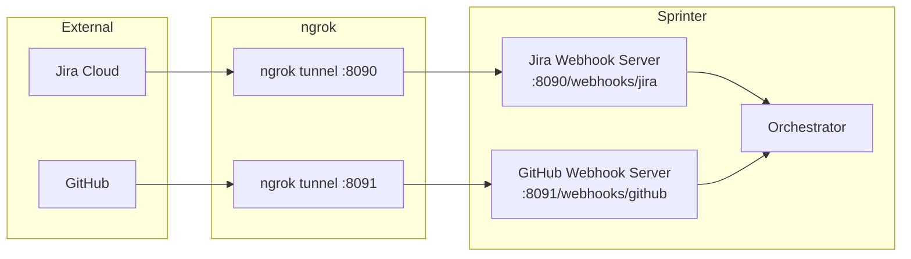

# Webhook Servers

Sprinter includes two webhook HTTP servers — one for Jira and one for GitHub — plus a programmatic Jira webhook management CLI. The orchestrator can auto-start both webhook servers, or they can run standalone.

## Architecture Overview



---

## Jira Webhook Server (`webhooks/`)

Receives Jira webhook payloads, authenticates them, parses issue events, deduplicates, and either enqueues jobs locally or forwards them to the orchestrator.

### Source Files

| File | Purpose |
|---|---|
| `webhooks/app.py` | `WebhookApplication` core and `ThreadingHTTPServer` adapter |
| `webhooks/parser.py` | `JiraWebhookParser` — extracts issue key, event type, project, actor |
| `webhooks/security.py` | `SecretVerifier` — validates `X-Sprinter-Webhook-Secret` header |
| `webhooks/store.py` | `FilesystemWebhookStore` — idempotent event recording and job queue |
| `webhooks/worker.py` | `WebhookWorker` — background thread that processes queued export jobs |
| `webhooks/models.py` | `WebhookEvent`, `WebhookDecision`, `WebhookJob` data models |
| `webhooks/settings.py` | `WebhookSettings` — loads from environment + `webhooks/config.yaml` |
| `webhooks/server.py` | Standalone CLI entrypoint |
| `webhooks/setup.py` | ngrok + Jira webhook registration orchestration script |

### Configuration

**`webhooks/config.yaml`** — Server defaults:

```yaml
server:
  host: "127.0.0.1"
  port: 8090
  jira_path: "/webhooks/jira"

auth:
  secret: ""                            # Use env var instead
  secret_env: "SPRINTER_WEBHOOK_SECRET"
  secret_header: "X-Sprinter-Webhook-Secret"

events:
  allowed_events:
    - "jira:issue_created"
    - "jira:issue_updated"
    # ... (14 event types total)
  allowed_projects: []     # empty = allow all
  ignored_actors: []       # actor emails to ignore
```

**`webhooks/ngrok_config.yaml`** — ngrok + setup script settings:

```yaml
ngrok:
  auth_token: ""
  auth_token_env: "NGROK_AUTHTOKEN"
  addr: "http://127.0.0.1:8090"

jira_webhook:
  name: "Sprinter local export webhook"
  jql: "project = SCRUM"
  replace_existing: true
  delete_on_exit: false
  events:
    - "jira:issue_created"
    - "jira:issue_updated"
    # ...
```

### Environment Variables

| Variable | Description |
|---|---|
| `SPRINTER_WEBHOOK_SECRET` | HMAC secret for validating inbound Jira webhooks |
| `SPRINTER_WEBHOOK_HOST` | Override server host |
| `SPRINTER_WEBHOOK_PORT` | Override server port |
| `SPRINTER_WEBHOOK_CONFIG` | Path to Sprinter `config.yaml` |
| `SPRINTER_WEBHOOK_USE_ORCHESTRATOR` | Set to `true` to forward events to the orchestrator |
| `NGROK_AUTHTOKEN` | ngrok authentication token |

### Running Standalone

```bash
.venv/bin/python -m webhooks.server
```

### Setup with ngrok

The setup script starts the webhook server, starts ngrok, registers a webhook in Jira via its REST API, runs a readiness check, and optionally sends a smoke test:

```bash
.venv/bin/python -m webhooks.setup
```

### Request Flow

1. Jira sends POST to `/webhooks/jira`
2. `SecretVerifier` checks the `X-Sprinter-Webhook-Secret` header
3. `JiraWebhookParser` extracts issue key, event type, project, and actor
4. `FilesystemWebhookStore` deduplicates by event ID (TTL-based)
5. If orchestrator mode is enabled → `orchestrator.submit_jira_webhook(event)`
6. Otherwise → `store.enqueue_job(event)` → `WebhookWorker` processes it

---

## GitHub Webhook Server (`github_webhooks/`)

Receives GitHub webhook payloads for pull request, push, and review comment events. After signature verification and delivery deduplication, the server normalizes events and forwards them to the orchestrator.

### Source Files

| File | Purpose |
|---|---|
| `github_webhooks/app.py` | `GitHubWebhookApplication` core and HTTP server adapter |
| `github_webhooks/parser.py` | `GitHubWebhookParser` — normalizes PR/push events to orchestrator events |
| `github_webhooks/security.py` | HMAC-SHA256 signature verification (`X-Hub-Signature-256`) |
| `github_webhooks/store.py` | `GitHubWebhookStore` — delivery ID deduplication on disk |
| `github_webhooks/server.py` | Standalone CLI entrypoint |
| `github_webhooks/setup.py` | ngrok + GitHub webhook registration orchestration script |

### Configuration

**`github_webhooks/ngrok_config.yaml`**:

```yaml
ngrok:
  auth_token: ""
  auth_token_env: "NGROK_AUTHTOKEN"
  addr: "http://127.0.0.1:8091"

webhook_server:
  host: "127.0.0.1"
  port: 8091
  path: "/webhooks/github"
  store_path: "exports/.github_webhooks"

github_webhook:
  events:
    - "pull_request"
    - "push"
    - "pull_request_review_comment"
  active: true
  content_type: "json"
  replace_existing: true
  delete_on_exit: false
```

### Environment Variables

| Variable | Description |
|---|---|
| `SPRINTER_GITHUB_TOKEN` | GitHub personal access token (repo scope) |
| `SPRINTER_GITHUB_OWNER` | Repository owner or organization |
| `SPRINTER_GITHUB_REPO` | Repository name |
| `SPRINTER_GITHUB_WEBHOOK_SECRET` | Shared HMAC secret for GitHub webhook signature verification |
| `NGROK_AUTHTOKEN` | ngrok authentication token |

### Running Standalone

```bash
.venv/bin/python -m github_webhooks.server --host 127.0.0.1 --port 8091 --path /webhooks/github
```

### Setup with ngrok

```bash
SPRINTER_GITHUB_TOKEN=<token> \
SPRINTER_GITHUB_OWNER=<owner> \
SPRINTER_GITHUB_REPO=<repo> \
SPRINTER_GITHUB_WEBHOOK_SECRET=<secret> \
.venv/bin/python -m github_webhooks.setup
```

Useful flags:
```bash
--skip-smoke-test    # Skip the smoke test after registration
--keep-existing      # Don't delete existing webhooks before creating
--no-register        # Start servers without registering with GitHub
```

### Handled Events

| GitHub Event | Orchestrator Event | Action |
|---|---|---|
| `pull_request.opened` | `github.pull_request.opened` | Queue `review_pull_request` |
| `pull_request.synchronize` | `github.pull_request.synchronize` | Queue `review_pull_request` |
| `pull_request.reopened` | `github.pull_request.reopened` | Queue `review_pull_request` |
| `push` (to base branch) | `github.push.main` | Queue `review_pull_request` |
| `pull_request_review_comment` | `github.pull_request_review_comment.created` | Observed only (no action) |

Review comments are observed to prevent Sprinter's own review from triggering another review cycle.

---

## Jira Webhook API CLI (`webhookAPI/`)

A command-line tool for programmatic Jira webhook management. Supports both admin (REST API v2) and dynamic (app) webhooks.

### Source Files

| File | Purpose |
|---|---|
| `webhookAPI/__init__.py` | Package init |
| `webhookAPI/__main__.py` | Module entrypoint |
| `webhookAPI/cli.py` | CLI argument parser and command dispatcher |
| `webhookAPI/client.py` | `JiraWebhookAPIClient` — REST client for webhook CRUD |
| `webhookAPI/factory.py` | `build_webhook_api_client` — creates client from config |

### Commands

```bash
# Admin webhooks
.venv/bin/python -m webhookAPI admin-create --url <callback_url> --jql "project = SCRUM"
.venv/bin/python -m webhookAPI admin-list
.venv/bin/python -m webhookAPI admin-get <webhook_id>
.venv/bin/python -m webhookAPI admin-delete <webhook_id>

# Dynamic (app) webhooks
.venv/bin/python -m webhookAPI dynamic-register --url <callback_url>
.venv/bin/python -m webhookAPI dynamic-list
.venv/bin/python -m webhookAPI dynamic-delete <webhook_id1> <webhook_id2>
.venv/bin/python -m webhookAPI dynamic-refresh <webhook_id>
```

---

## How the Orchestrator Auto-starts Webhook Servers

When `webhook_servers.auto_start` is `true` in `orchestrator/config.yaml`, running `.venv/bin/python -m orchestrator start` will:

1. Create a `WebhookServerManager` instance
2. Start the Jira webhook server in a daemon thread on port 8090
3. Start the GitHub webhook server in a daemon thread on port 8091
4. Both servers remain alive for the lifetime of the orchestrator process
5. On shutdown (SIGINT/SIGTERM), both servers are stopped gracefully

You can verify readiness at:
```text
http://127.0.0.1:8090/ready
http://127.0.0.1:8091/ready
```

To disable auto-start and run webhook servers separately:
```yaml
webhook_servers:
  auto_start: false
```

## Tests

```bash
# Jira webhook tests
.venv/bin/python -m unittest tests.test_webhooks -v
.venv/bin/python -m unittest tests.test_webhook_setup -v
.venv/bin/python -m unittest tests.test_webhook_api -v

# GitHub webhook tests
.venv/bin/python -m unittest tests.test_github_webhooks -v
.venv/bin/python -m unittest tests.test_github_webhook_setup -v

# Orchestrator webhook server integration
.venv/bin/python -m unittest tests.test_orchestrator_webhook_servers -v
```
