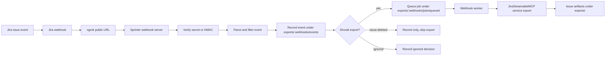

# Sprinter Webhooks

`webhooks/` lets Sprinter react when Jira pushes an event instead of waiting for a manual CLI or MCP request.

At runtime, Jira sends an issue-scoped webhook to the local Sprinter webhook server. The server verifies the request, normalizes the Jira payload, records the event on disk, queues an export job, and a background worker exports the issue into the normal Sprinter `exports/` artifact structure.

## What This Package Provides

- `webhooks.server`: starts the local HTTP server.
- `webhooks.app`: routes `/webhooks/jira`, `/health`, `/ready`, and `/jobs/<job_id>`.
- `webhooks.security`: validates either a local shared-secret header or Jira `X-Hub-Signature` HMAC.
- `webhooks.parser`: converts Jira webhook payloads into normalized Sprinter events.
- `webhooks.store`: stores webhook events and export jobs as JSON files.
- `webhooks.worker`: processes queued jobs and runs the existing Sprinter Jira export flow.
- `webhooks.setup`: starts the server, starts ngrok, registers the Jira webhook, and checks readiness.
- `webhooks/config.yaml`: runtime settings for the webhook server.
- `webhooks/ngrok_config.yaml`: optional orchestration settings for ngrok plus Jira registration.

## How It Works



The server is intentionally small and filesystem-based. There is no SQLite database and no third-party web framework involved.

## Prerequisites

Run these commands from the repository root.

```bash
python -m venv .venv
.venv/bin/pip install -r requirements.txt
```

Set Jira credentials for the root `config.yaml`.

```bash
export ATLASSIAN_EMAIL="you@example.com"
export ATLASSIAN_API_TOKEN="your-atlassian-api-token"
```

Then update root `config.yaml` for your Jira site.

```yaml
jira:
  base_url: "https://your-domain.atlassian.net"
  auth:
    type: "basic"
    email_env: "ATLASSIAN_EMAIL"
    token_env: "ATLASSIAN_API_TOKEN"

confluence:
  base_url: "https://your-domain.atlassian.net/wiki"
  auth:
    type: "basic"
    email_env: "ATLASSIAN_EMAIL"
    token_env: "ATLASSIAN_API_TOKEN"

storage:
  export_path: "./exports"
```

For public Jira delivery to a local machine, install the `ngrok` CLI if you plan to use `webhooks.setup`.

## Webhook Server Configuration

The default server settings live in `webhooks/config.yaml`.

```yaml
server:
  host: "127.0.0.1"
  port: 8090
  jira_path: "/webhooks/jira"
  log_level: "INFO"

auth:
  secret: "change-me-local-webhook-secret"
  secret_env: "SPRINTER_WEBHOOK_SECRET"
  secret_header: "X-Sprinter-Webhook-Secret"
```

For local development, you can edit `auth.secret` directly. For shared environments, prefer an environment variable so the secret is not committed.

```bash
export SPRINTER_WEBHOOK_SECRET="a-long-random-secret"
```

If `SPRINTER_WEBHOOK_SECRET` is set, it overrides `auth.secret` in `webhooks/config.yaml`.

## Start Only The Local Webhook Server

Use this mode when you want to test locally or manage ngrok and Jira webhooks yourself.

```bash
.venv/bin/python -m webhooks.server \
  --config config.yaml \
  --webhook-config webhooks/config.yaml
```

Expected log line:

```text
Sprinter webhook server listening on http://127.0.0.1:8090/webhooks/jira
```

Check health:

```bash
curl -s http://127.0.0.1:8090/health
```

Expected response:

```json
{
  "status": "ok",
  "service": "sprinter-webhooks"
}
```

Check readiness:

```bash
curl -s http://127.0.0.1:8090/ready
```

Expected response:

```json
{
  "status": "ready",
  "worker_enabled": true
}
```

If you only want to receive and queue events without processing exports, run:

```bash
.venv/bin/python -m webhooks.server \
  --config config.yaml \
  --webhook-config webhooks/config.yaml \
  --no-worker
```

## Local Smoke Test Without Jira

This sends a fake Jira issue-created event directly to the local server. Replace `SCRUM-1` with an issue key that exists in your Jira if the worker is enabled.

```bash
curl -s -X POST http://127.0.0.1:8090/webhooks/jira \
  -H "Content-Type: application/json" \
  -H "X-Sprinter-Webhook-Secret: change-me-local-webhook-secret" \
  -d '{
    "webhookEvent": "jira:issue_created",
    "webhookEventId": "manual-smoke-1",
    "issue": {
      "key": "SCRUM-1",
      "fields": {
        "project": {
          "key": "SCRUM"
        }
      }
    },
    "user": {
      "emailAddress": "tester@example.com"
    }
  }'
```

Possible responses:

```json
{
  "status": "accepted",
  "job_id": "abcd1234...",
  "issue_key": "SCRUM-1",
  "event_id": "manual-smoke-1"
}
```

```json
{
  "status": "duplicate",
  "issue_key": "SCRUM-1",
  "event_id": "manual-smoke-1"
}
```

Use the returned `job_id` to inspect progress.

```bash
curl -s http://127.0.0.1:8090/jobs/<job_id>
```

Job statuses are `queued`, `running`, `success`, and `failed`.

## Run The Full Automated Setup

Use this mode when you want one command to start everything:

1. Start the local webhook server.
2. Start ngrok and create a public HTTPS URL.
3. Register or replace the Jira admin webhook.
4. Check local readiness, public readiness, and optionally run a signed smoke test.

First set your ngrok token:

```bash
export NGROK_AUTHTOKEN="your-ngrok-authtoken"
```

Then edit `webhooks/ngrok_config.yaml` for your project.

```yaml
ngrok:
  command: "ngrok"
  auth_token: ""
  auth_token_env: "NGROK_AUTHTOKEN"
  addr: "http://127.0.0.1:8090"
  api_url: "http://127.0.0.1:4040/api/tunnels"
  inspect: true
  url:

webhook_server:
  host: "127.0.0.1"
  port: 8090
  path: "/webhooks/jira"
  config_path: "config.yaml"
  webhook_config_path: "webhooks/config.yaml"

jira_webhook:
  name: "Sprinter local export webhook"
  description: "Export SCRUM issues into Sprinter artifacts when Jira sends issue-scoped webhook events."
  jql: "project = SCRUM"
  replace_existing: true
  delete_on_exit: false

checks:
  timeout_seconds: 45
  poll_interval_seconds: 1
  run_smoke_test: true
  smoke_issue_key: "SCRUM-1"
```

Important fields:

- `ngrok.auth_token`: leave empty if you use `NGROK_AUTHTOKEN`.
- `ngrok.url`: optional reserved ngrok domain, if your ngrok account provides one.
- `jira_webhook.jql`: limits which Jira issues can trigger this webhook.
- `jira_webhook.replace_existing`: deletes existing Jira admin webhooks with the same name before creating a new one.
- `jira_webhook.delete_on_exit`: deletes the created Jira webhook when you stop setup with `Ctrl+C`.
- `checks.smoke_issue_key`: issue key used for the signed end-to-end smoke test.

Start setup:

```bash
.venv/bin/python -m webhooks.setup
```

Expected output includes:

```text
Webhook server ready: http://127.0.0.1:8090/webhooks/jira
ngrok public URL: https://...
Jira webhook URL: https://.../webhooks/jira
Jira webhook registered: <id>
Smoke test completed successfully for SCRUM-1: <job_id>
Webhook setup is ready. Press Ctrl+C to stop webhook server and ngrok.
```

Useful setup flags:

```bash
.venv/bin/python -m webhooks.setup --skip-smoke-test
.venv/bin/python -m webhooks.setup --keep-existing
.venv/bin/python -m webhooks.setup --no-register
.venv/bin/python -m webhooks.setup --config webhooks/ngrok_config.yaml
```

Use `--skip-smoke-test` if `checks.smoke_issue_key` does not exist yet.

Use `--no-register` if you only want the server and ngrok public URL.

## Manual Jira Webhook Registration

If you prefer to start the server and ngrok yourself, register the Jira webhook with `webhookAPI`.

Start the local server:

```bash
.venv/bin/python -m webhooks.server \
  --config config.yaml \
  --webhook-config webhooks/config.yaml
```

Start ngrok in another terminal:

```bash
ngrok http http://127.0.0.1:8090
```

Copy the HTTPS forwarding URL from ngrok and register Jira:

```bash
.venv/bin/python -m webhookAPI --config config.yaml admin-create \
  --name "Sprinter local export webhook" \
  --url "https://<your-ngrok-domain>/webhooks/jira" \
  --jql "project = SCRUM" \
  --secret "change-me-local-webhook-secret"
```

List registered admin webhooks:

```bash
.venv/bin/python -m webhookAPI --config config.yaml admin-list
```

Delete a webhook when you are done:

```bash
.venv/bin/python -m webhookAPI --config config.yaml admin-delete <webhook_id>
```

## Jira Event Handling

The default allowed events are:

- `jira:issue_created`
- `jira:issue_updated`
- `jira:issue_deleted`
- `comment_created`
- `comment_updated`
- `comment_deleted`
- `worklog_created`
- `worklog_updated`
- `worklog_deleted`
- `attachment_created`
- `attachment_deleted`
- `issuelink_created`
- `issuelink_deleted`
- `issue_property_set`
- `issue_property_deleted`

Most accepted events enqueue an export job for the issue. `jira:issue_deleted` is handled differently: the server records the event and skips export because Jira may no longer allow reading the deleted issue.

You can restrict the server further in `webhooks/config.yaml`:

```yaml
events:
  allowed_projects:
    - "SCRUM"
  ignored_actors:
    - "automation@example.com"
```

You can also override event filters with environment variables:

```bash
export SPRINTER_WEBHOOK_ALLOWED_EVENTS="jira:issue_created,jira:issue_updated"
export SPRINTER_WEBHOOK_ALLOWED_PROJECTS="SCRUM,ENG"
export SPRINTER_WEBHOOK_IGNORED_ACTORS="automation@example.com"
```

## Authentication Modes

The server accepts either of these:

- Local test header: `X-Sprinter-Webhook-Secret: <secret>`
- Jira HMAC header: `X-Hub-Signature: sha256=<digest>`

For local tests, the shared-secret header is easiest.

For Jira admin webhooks, pass the same secret during registration. Jira signs the raw request body with that secret and sends `X-Hub-Signature`. The server recomputes the HMAC and rejects mismatches.

## Files Written By The Webhook Server

By default, state is stored under `<storage.export_path>/.webhooks/`. With the default root config, that means `exports/.webhooks/`.

```text
exports/
  .webhooks/
    events/
      <sha256-dedupe-key>.json
    jobs/
      queued/
      running/
      success/
      failed/
    tmp/
  <ISSUE-KEY>/
    export_manifest.json
    jira_issue.json
    ...
```

The webhook store files are operational state. The exported issue folders are the normal Sprinter artifacts.

## Environment Variables

Server settings:

- `SPRINTER_WEBHOOK_SETTINGS_FILE`: path to webhook YAML settings.
- `SPRINTER_WEBHOOK_HOST`: bind host.
- `SPRINTER_WEBHOOK_PORT`: bind port.
- `SPRINTER_WEBHOOK_JIRA_PATH`: webhook route, usually `/webhooks/jira`.
- `SPRINTER_WEBHOOK_CONFIG`: root Sprinter config path.
- `SPRINTER_CONFIG`: fallback root Sprinter config path.
- `SPRINTER_WEBHOOK_LOG_LEVEL`: `DEBUG`, `INFO`, `WARNING`, `ERROR`, or `CRITICAL`.
- `SPRINTER_WEBHOOK_SECRET_ENV`: name of the env var that stores the secret.
- `SPRINTER_WEBHOOK_SECRET`: default secret env var.
- `SPRINTER_WEBHOOK_SECRET_HEADER`: local shared-secret header name.
- `SPRINTER_WEBHOOK_ALLOWED_EVENTS`: comma-separated allowed events.
- `SPRINTER_WEBHOOK_ALLOWED_PROJECTS`: comma-separated project keys.
- `SPRINTER_WEBHOOK_IGNORED_ACTORS`: comma-separated actor identifiers.
- `SPRINTER_WEBHOOK_IDEMPOTENCY_TTL_SECONDS`: duplicate event retention window.
- `SPRINTER_WEBHOOK_STORE_PATH`: custom store path.
- `SPRINTER_WEBHOOK_POLL_INTERVAL_SECONDS`: worker polling interval.
- `SPRINTER_WEBHOOK_WORKER_ENABLED`: `true` or `false`.

Setup settings:

- `NGROK_AUTHTOKEN`: ngrok auth token used by `webhooks.setup` when `ngrok.auth_token` is empty.
- `ATLASSIAN_EMAIL`: Jira user email used by root `config.yaml`.
- `ATLASSIAN_API_TOKEN`: Jira API token used by root `config.yaml`.

## Common Commands

Start server:

```bash
.venv/bin/python -m webhooks.server --config config.yaml --webhook-config webhooks/config.yaml
```

Start server without worker:

```bash
.venv/bin/python -m webhooks.server --config config.yaml --webhook-config webhooks/config.yaml --no-worker
```

Run automated setup:

```bash
.venv/bin/python -m webhooks.setup
```

Run setup without registering Jira:

```bash
.venv/bin/python -m webhooks.setup --no-register
```

Run setup without smoke test:

```bash
.venv/bin/python -m webhooks.setup --skip-smoke-test
```

Check local readiness:

```bash
curl -s http://127.0.0.1:8090/ready
```

Check a job:

```bash
curl -s http://127.0.0.1:8090/jobs/<job_id>
```

List Jira admin webhooks:

```bash
.venv/bin/python -m webhookAPI --config config.yaml admin-list
```

Delete a Jira admin webhook:

```bash
.venv/bin/python -m webhookAPI --config config.yaml admin-delete <webhook_id>
```

## Troubleshooting

### `Webhook settings error: SPRINTER_WEBHOOK_SECRET must be set`

The server could not find a secret. Either set `auth.secret` in `webhooks/config.yaml` or export `SPRINTER_WEBHOOK_SECRET`.

```bash
export SPRINTER_WEBHOOK_SECRET="a-long-random-secret"
```

### `/ready` returns `not_ready`

The server could not initialize its filesystem store. Check `storage.export_path` in root `config.yaml`, or set a writable custom path.

```bash
export SPRINTER_WEBHOOK_STORE_PATH="./exports/.webhooks"
```

### Local smoke test returns `unauthorized`

The request did not include a valid `X-Sprinter-Webhook-Secret` or `X-Hub-Signature`. Make sure your curl header matches the configured webhook secret exactly.

### Jira webhook delivery fails

Check these items:

- The ngrok URL is HTTPS.
- The Jira webhook URL ends with `/webhooks/jira`.
- The local server is still running.
- `curl -s http://127.0.0.1:8090/ready` returns `ready`.
- The public ngrok readiness URL works: `curl -s https://<your-ngrok-domain>/ready`.
- The Jira webhook secret matches the server secret.

### Jobs fail after being accepted

The webhook was received, but the export worker could not export the issue. Check:

- The issue key exists and is readable by your Jira credentials.
- `ATLASSIAN_EMAIL` and `ATLASSIAN_API_TOKEN` are set.
- Root `config.yaml` points at the correct Jira site.
- The job details endpoint includes the failure reason: `curl -s http://127.0.0.1:8090/jobs/<job_id>`.

### Duplicate events are ignored

This is expected. The store deduplicates events using the Jira event id, issue key, and event type. The default duplicate window is `86400` seconds.

To change it:

```yaml
store:
  idempotency_ttl_seconds: 3600
```

### Deleted issues do not export

This is intentional. `jira:issue_deleted` events are recorded only because deleted Jira issues may no longer be readable through the Jira REST API.

## Development Checks

Run the webhook test suite:

```bash
.venv/bin/python -m unittest tests.test_webhooks tests.test_webhook_setup
```

Run the full project test suite:

```bash
.venv/bin/python -m unittest discover
```

Compile the webhook package:

```bash
.venv/bin/python -m compileall webhooks
```
